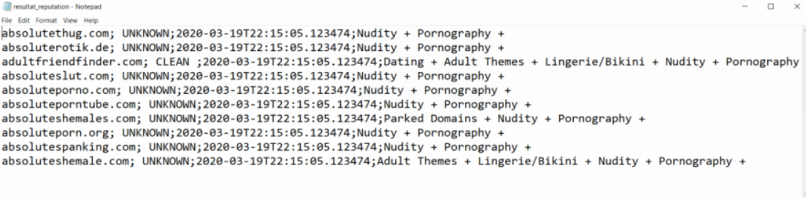
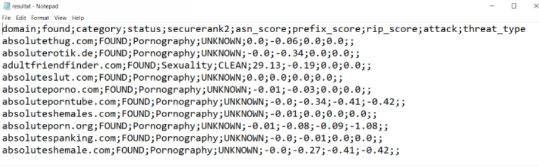
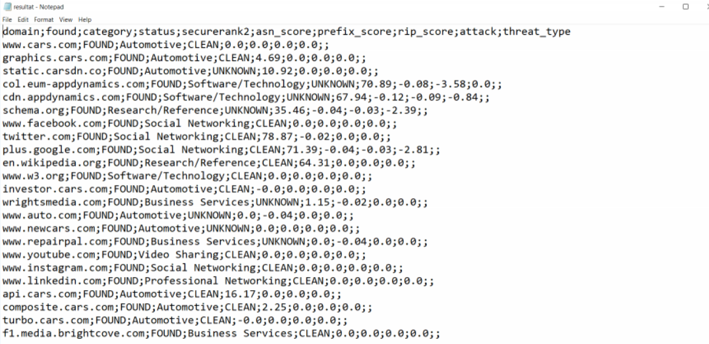

# Umbrella Investigate Requests examples

This set of scripts request domain reputation to the Umbrella Investigate Backend, for a list of domains which are contained into the <b>domain.txt</b> file.

The last script will dynamically get domain reputations for domains in all URLs contained in any INTERNET Web Page.

You must have access to INVESTIGATE in order to be able to run these scripts.  Thanks to this you will be able to generate your Authentication token into the Umbrella INVESTIGATE Dashboard.

It is named  **investigate_api_key** in the scripts.

Instruction for generating your API token can be found in the umbrella online documentation.

https://docs.umbrella.com/investigate-api/docs/about-the-api-authentication

You must store your API token into the **token.txt** file.

For each domain into the <b>domain.txt</b> file, the script retrieves several security information which help to categorize domains by risk.

Result are stored into output text files into the **./output** directory

The goal behind this, is to dynamically create blocking rules into network security devices like Next Gen FireWall

## Installation

Installing these script is pretty straight forward . You can just copy and paste them into you python environment but a good practice is to run them into a python virtual environment.

### Install a Python virtual environment

	For Linux/Mac 

	python3 -m venv venv
	source bin activate

	For Windows 
	
	We assume that you already have installed git-bash.  If so open a git-bash console and :

	python -m venv venv
	source /venv/Scripts/activate

### git clone the scripts

	git clone https://github.com/pcardotatgit/Umbrella_Investigate_Check_Domain_Reputations.git
	cd Umbrella_Investigate_Check_Domain_Reputations/
	
### install needed python modules

These scripts use the following python modules

- requests
- json

You can install these modules with the following :

	pip install -r requirements.txt
	
## Running the scripts

First you must have a valid Investigate API token.  Copy it into the file named token.txt

Second test your connectivity with INVESTIGATE Backend.  Run the 1-test_access_to_investigate.py script

	$python 1-test_access_to_investigate.py
	
Then you are ready to go

Next step is to fill the domains.csv file with the domains you want to check. Put one domain per line

## Run the scripts

- 1/ for getting basic information for every domains

		$python 2-check_domain_reputation_and_categorization.py
	
	This above script will output into text file Risk status and categories of all domains in the domains.csv file
	

	
- 2/ Get more Security information about domains

		$python 3-check_domain_security_details.py
	
	This above script will give you more details on domains in the domains.csv files. These additionnal criteria could useful to be more accurate on blocking action you will do.

	

	
- 3/ Check Security Reputation of all links contained into a web page

		$python 4-check_links_status_from_a_webpage.py
	
	This above script first retreives all domains from url links contained into a web page and check for their Security Information.
	
	The script will ask you for the URL to check : for example www.cars.com  
	
	And here the result for all domains found in the landing page of this Web Site. Every looks clean !
	
	

# Credit and References

	Cisco DEVNET Express Security Workshop
	
